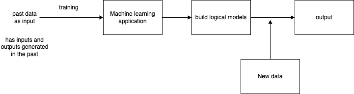

# Introduction to Machine Learning

-   Expect machines (computers) to learn from past data
-   Uses various algorithms for building mathematical model and making predictions
-   Use historical data

Uses:

-   Stock market predictions (apps)
-   Image processing
-   Face / speech recognision
-   Video filters
-   AI

## Machine learning - Classifications

-   Supervised learning
    -   Classification
    -   Regression
-   Unsupervised learning
    -   Clustering
    -   Association
-   Reinforcement learning

## Major steps involved in ML

-   Gathering of data
-   Data preparation
-   Data wrangling
-   Data analysis
-   Train model
-   Test model

# Exercises:

## Using the data in https://raw.githubusercontent.com/justmarkham/DAT8/master/data/chipotle.tsv

1. How many products cost more than $10.00?
1. What is the price of each item? (print a data frame with only two columns item_name and item_price)
1. Sort by the name of the item
1. What was the quantity of the most expensive item ordered?
1. How many times were a Veggie Salad Bowl ordered?
1. How many times people orderd more than one Canned Soda?

## Using the data in https://raw.githubusercontent.com/justmarkham/DAT8/master/data/drinks.csv

1. Which continent drinks more beer on average?
1. For each continent print the statistics for wine consumption.
1. Print the mean alcoohol consumption per continent for every column
1. Print the median alcoohol consumption per continent for every column
1. Print the mean, min and max values for spirit consumption.

## Using the data in https://raw.githubusercontent.com/justmarkham/DAT8/master/data/u.user

1. Discover what is the mean age per occupation
1. Discover the Male ratio per occupation and sort it from the most to the least
1. For each occupation, calculate the minimum and maximum ages
1. For each combination of occupation and gender, calculate the mean age
1. For each occupation present the percentage of women and men
